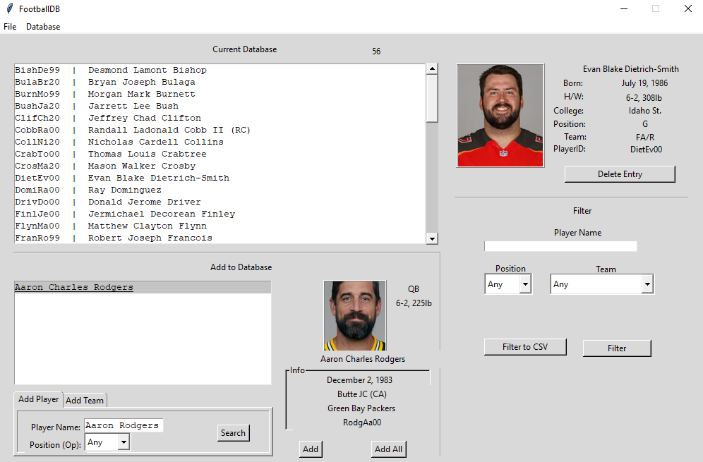

# getStat
8 week project for CS 564: Database Management Systems at UW-Madison.  Dataset creation tool for the personal data of NFL players.  Utilizes a local database along with web-scraping capabilities to allow the user to get information on both past and present players.  Ability to add individual players and whole teams from a specific year.

Data that is scraped:

- Name
- Position
- Team
- Height/Weight
- College
- PlayerID (Unique ID that can be used by other programs to scrape more data)

# Skills Involved
 - SQL
 - Python
# Bugs
There are still a few bugs.  This was a solo project that was meant to be worked on by three people so some things were left in a state that weren't perfect. 
 - Entry boxes on the GUI require the user to click in and out of them multiple times to get the value in the entry box to be saved in the back-end.  
	 - Being unfamiliar with python GUI development I learned too late into the project about entry box tracing so values are instantly updated on change.
- Foreign key constraint can lead to unreliable player import results
	- At the moment, the player position table is initialized on creation of a new database file with hard-coded values.  This leads to problems because positions can be called many different things by different people.  Importing a player with a position that isn't in the position table leads to an error.
